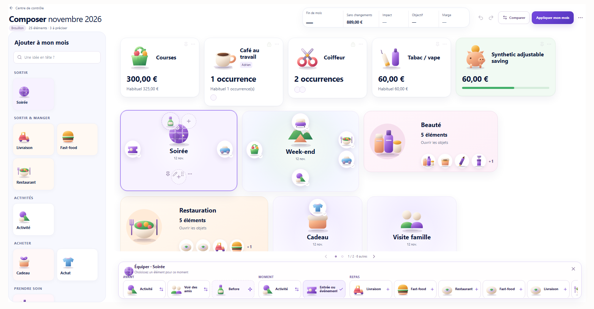
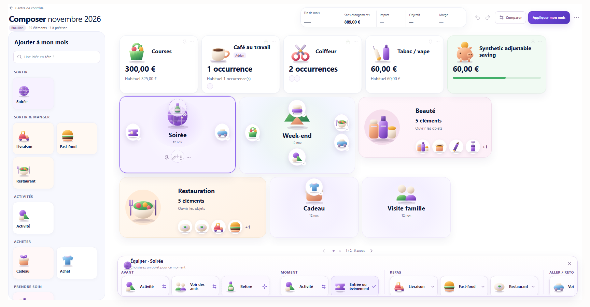
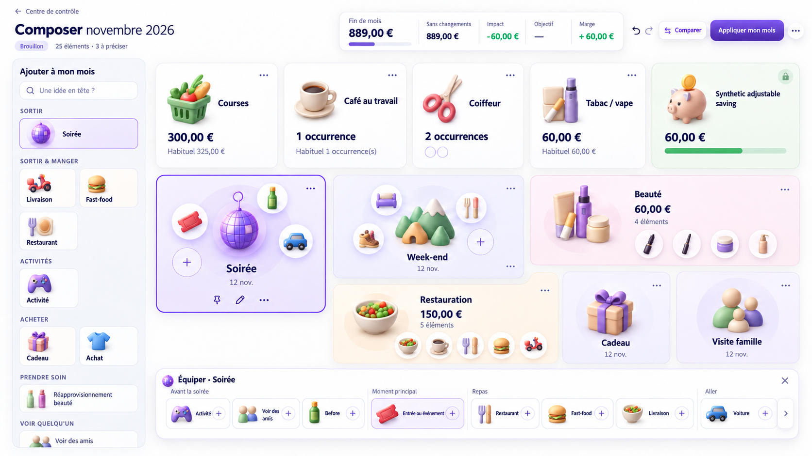

# Composer R6 P3.5 — nettoyage visuel et interactions

**Verdict : PASS.** Cette passe améliore la présentation de P3 et s'arrête avant P4.

## État d'entrée et audit

- Dépôt : `Budgetisation`, branche `main`, arbre propre au départ.
- HEAD avant : `baabfe5d7b03edb7d6a34b1fab9ce6c47d586251`.
- Références relues : rapports R6 P0, P1/P2 et P3, brief UI/UX V3 et mockup fourni.
- Reproduction avant code sur fixture `VISUAL` aux trois tailles demandées. Les captures avant sont conservées dans l'audit local ; la capture P3 publiée se trouve aussi sous `images/composer-r6-p3/`.

| À 1728×900, Soirée sélectionnée | P3 | P3.5 |
| --- | ---: | ---: |
| Surfaces principales sur la première page | 11 | 11 |
| Tiles brutes / visuelles dans Équiper | 26 | 16 |
| Choix visuels dans Repas | 6 | 3 |
| EMPTY visibles sur Soirée | 2 | 1 |
| Bas réel de Restauration, Cadeau, Visite famille | 750 px | 697 px |
| Bas de la zone sûre du board | 732 px | 720 px |
| Marge réelle sous les trois cartes | −18 px | +23 px |
| Haut du dock | 762 px | 750 px |

À 1920×1080, le plafond arbitraire de trois rangées laissait 11 surfaces sur la première page et un grand vide sous les cartes. La pagination suit désormais la hauteur disponible : les 17 surfaces de la fixture tiennent sur quatre rangées. À 1440×900, la pagination est conservée et les cartes restent entières sur les pages parcourues.

## Comparaison avec le mockup

| P3 avant | P3.5 | Mockup cible fourni |
| --- | --- | --- |
|  |  |  |

La Soirée P3.5 rapproche ses satellites du noyau, agrandit légèrement ce dernier, ajoute un halo discret et réduit le socket libre à une invitation secondaire. La palette sépare les groupes, présente des cartes de 140×62 px et montre environ huit objets avant défilement horizontal. Le mockup garde une composition Clay, une hiérarchie spatiale et un HUD plus expressifs ; ces écarts relèvent de P4.

## Projection de palette et routes multiples

`equipmentGroups` conserve toutes les options publiées. `displayEquipmentGroups` crée uniquement des tiles visuelles. Les paires de clés d'asset explicites `template:*` / `option:night-out:food:*` pour Repas et `option:night-out:outbound:*` / `option:night-out:return:*` pour Aller / Retour partagent une identité visuelle ; les autres clés restent distinctes. Aucun regroupement ne dépend du libellé ou de l'icône.

Une tile à route unique garde le clic et le drag directs. Une tile à plusieurs routes ouvre une fiche de choix avant le clic ou le drag : `Objet autonome` / `Composant du repas`, ou `Aller` / `Retour`. Chaque bouton garde son `assetKey`, sa `sourceKey`, son `slotKey`, son état et sa cible de commande. La tile principale n'est pas draggable tant que la route n'a pas été choisie. Le garde P3.5 compare l'ensemble des routes affichables à l'ensemble brut ; le smoke a vérifié les commandes réellement envoyées pour Restaurant, Extra, Aller et Retour.

## Sockets et espace du board

- Soirée et Week-end : REST = 0 EMPTY ; SELECTED = 1 EMPTY. Les autres modèles gardent leur plafond P3 de deux. Pendant un drag, les destinations compatibles nécessaires réapparaissent toutes.
- Hauteurs de présentation : objets composites 235 → 225 px ; simples 170 px ; clusters et Cadeau / Visite famille 178 px. Les miniatures des clusters restent visibles.
- La mosaïque et la pagination emploient le même gap de 10 px. Le carrousel mesure la hauteur réelle du viewport, après réservation du dock et de la navigation, ainsi que le padding CSS calculé. Le dock ouvert possède 120 px dans le flux ; il ne recouvre aucune carte. La navigation réserve toujours sa bande de 30 px et se cache visuellement pour une page unique.
- Les cellules reçoivent la hauteur de leur objet de présentation, ce qui aligne la mesure, la pagination et le rendu. Le plafond de trois rangées a été retiré : une quatrième rangée apparaît uniquement quand elle tient réellement.

## Vérification

| Vérification | Résultat |
| --- | --- |
| `typecheck`, `build` | PASS |
| `check:composer-r6-p35` | PASS, R6-P35-001 à 014 |
| `check:composer-r6-p3`, `check:composer-r6-presentation` | PASS |
| `check:phase2-planner-contexts`, `check:phase2-planner-mobility` | PASS |
| `check:phase2-planned-reality`, `check:phase2-planner-composer`, `check-phase2-planner-interactions.mjs` | PASS |
| `check:phase2-planner-visual-fidelity`, `check:phase2-planner-atomic-ui`, `check:phase2-planner-final-polish` | PASS |
| Smoke Chrome, fixture synthétique | PASS : sélection, palette, déduplication, clic, drag, routes multiples, remplacement, Week-end, clusters, pagination, Undo/Redo, Compare, corbeille et refus protégé |
| Planner Kernel | `KNOWN_BASELINE_FAILURE_STALE_FORECAST_ORACLE`, hors périmètre ; Forecast inchangé |

Le smoke mesure les trois cartes basses à 697 px pour une limite sûre à 720 px à 1728×900. À 1440×900, les deux pages parcourues ne coupent aucune carte. Les preuves détaillées sont dans `images/composer-r6-p35/browser-verification.json`.

### Captures P3.5

- [Board 1728×900](images/composer-r6-p35/board-p35-1728x900.png), [1920×1080](images/composer-r6-p35/board-p35-1920x1080.png), [1440×900](images/composer-r6-p35/board-p35-1440x900.png)
- [Soirée sélectionnée](images/composer-r6-p35/soiree-p35-selected.png), [palette Soirée](images/composer-r6-p35/soiree-p35-palette.png), [Week-end sélectionné](images/composer-r6-p35/weekend-p35-selected.png)
- [Rangée basse](images/composer-r6-p35/row-bottom-p35.png), [choix Restaurant](images/composer-r6-p35/restaurant-palette-p35.png), [mockup cible](images/composer-r6-p35/mockup-cible.png)

## Périmètre et handoff

`BUSINESS_CODE_CHANGED = NO` ; `SERVER_OWNER_CHANGED = NO` ; `DTO_CHANGED = NO` ; `DB_MIGRATION_CREATED = NO` ; `NEW_SERVER_CALLS = 0` ; `NEW_READWORLD_CALLS = 0`. Le script de fixture ajoute seulement des noms de scénarios synthétiques pour isoler les gestes navigateur. Les tests structuraux et le smoke constatent zéro écriture distante et zéro écriture en base pour les lectures de contrôle.

Écarts à réserver à P4 : gravité sémantique et packing organique global, volume Clay final, HUD et Compare, animation et mémoire spatiale, puis revue de contraste et d'accessibilité complète. **Prochaine étape : audit visuel humain de P3.5, puis décision sur P4.**
