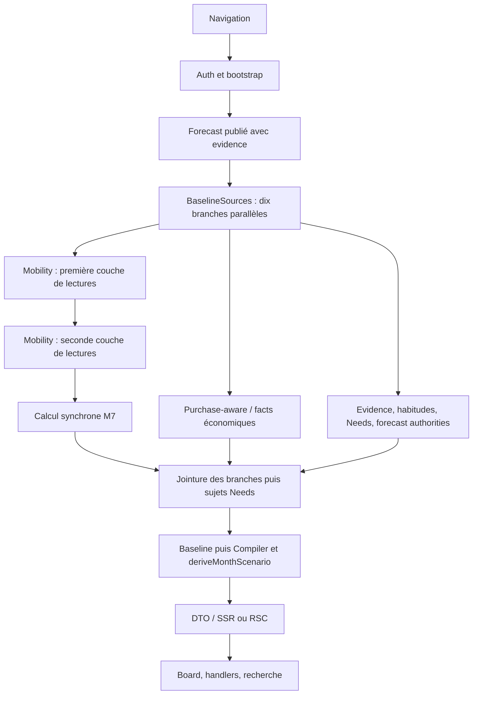

# Composer — audit performance P0

Mesures réalisées les 6–7 octobre 2026, heure de Paris. Le nom du fichier suit la mission du 6 octobre.

Base produit : **R5, `3eba1887571aa649696a21beb0e642495d188fab`, branche locale `main`**. Next 16.2.6, React 19.2.6, Node 24.19.0, Supabase JS 2.112.2, Temporal polyfill 0.5.1. Production Next locale, Supabase distante authentifiée ; cette série ne mesure pas le déploiement Vercel R4. Aucun push ni déploiement.

## 1. Résumé exécutif

Le Composer réel devient interactif en **68,08 s médianes après hard refresh**, entre 43,01 et 84,45 s. La première réponse arrive en 66,66 s médianes : environ **98 % du délai médian précède cette réponse**. Le chargement attend essentiellement les owners serveur.

Le principal coût identifié est le calcul de contexte de mobilité historique M7 : **832 557 comparaisons d'intervalles et 2 463 850 conversions `Temporal.Instant` par lecture**. Sur une lecture complète réelle de 67,51 s, sa partie synchrone occupe **41,11 s, soit 60,9 %** du chemin critique. Ce blocage retarde également la réception de réponses REST déjà en cours.

La deuxième famille de coûts est l'hydratation des autorités historiques : **291 GET métier Supabase par requête Composer Next**, avec plusieurs couches de lots et des vues financières. Les validations répétées du fuseau et la taille des données décodées ajoutent du CPU.

Les essais locaux conservant les mêmes faits et tous les digests ramènent le read-owner sans latence réseau de **39,08 à 12,51 s médianes** en combinant réutilisation des instants et validation du fuseau. Ce résultat porte sur un replay local, pas sur une page optimisée déployée.

## 2. Définition des jalons et protocole

| Jalon | Mesure retenue | Limite |
|---|---|---|
| T0 | Horloge avant navigation/clic CDP | Inclut quelques millisecondes de dispatch |
| T1 | Entrée HTTP Node, disponible sur la série client | Les premières séries ont seulement l'événement réseau navigateur |
| T2 | Premier octet HTML ou RSC reçu | Séparé du chargement des ressources et du montage |
| T3 | Fin du read-owner/DTO serveur ; réponse JSON reçue sur fixture | Pas de marqueur DTO distinct dans le build Next R5 initial |
| T4 | Board présent avec hauteur positive | DOM mesuré à cet instant, avant recherche |
| T5 | Premiers handlers React attachés à une commande Composer | Proxy d'adoption SSR, pas preuve d'achèvement de chaque effet/lazy boundary |
| T6 | Saisie native dans la Library et résultat de recherche observé | Parcours Undo/Redo et composition couverts par les fixtures R5 ; aucun Apply réel |

T6 mesure la première utilisation locale disponible. La réponse à une future mutation serveur n'est pas incluse dans ce temps d'ouverture. Le code recrée les dépendances à chaque action : une preview ultérieure peut réexécuter les owners coûteux. Son temps distant n'a pas été mesuré en modifiant un draft réel.

Cold : process Next neuf, contexte navigateur neuf, cookies transmis en mémoire, démarrage du serveur exclu de T0. Cela ne vide pas les caches de Supabase. Hard : refresh ignorant le cache HTTP navigateur. Warm : parent chargé, ouverture document du Composer, parent puis réouverture. Client : ouverture du Centre, bouton `Piloter mon mois`, navigation RSC vérifiée. Un lien `<a>` a aussi été mesuré séparément.

Cinq essais par mode ; p95 approximatif = rang supérieur, donc maximum pour n=5. Les erreurs sont conservées séparément. La fixture desktop utilise 1728×900, `mobile=false`, avec 758 px disponibles pour le Board. Les anciennes séries réelles n'enregistrent pas la taille CSS disponible : elles ne servent pas à une certification de layout.

## 3. Cold, warm, refresh et navigation client

Temps T0→T6 en secondes, hors échecs :

| Mode | Succès | Min | Médiane | p95 approx. | Max |
|---|---:|---:|---:|---:|---:|
| Cold, serveur/contexte neufs | 5/5 | 52,81 | 67,45 | 120,68 | 120,68 |
| Hard refresh | 5/5 | 43,01 | 68,08 | 84,45 | 84,45 |
| Warm, parent puis document Composer | 4/5 | 56,08 | 64,85 | 73,47 | 73,47 |
| Bouton du Centre, navigation RSC | 5/5 | 36,31 | 72,10 | 82,12 | 82,12 |
| Lien parent, nouveau document | 5/5 | 43,49 | 56,13 | 157,96 | 157,96 |

Le cinquième warm n'atteint pas T6 à **243,68 s**. Une requête Auth `/auth/v1/user` retourne **504**. Le p95 de la population incluant cet essai censuré est au moins le seuil de quatre minutes ; 73,47 s décrit seulement les réussites. Les séries ne prouvent pas que warm ou RSC accélère le read-owner.

Une charge préparatoire concurrente à des travaux de build a été exclue. Une partie de la première série warm chevauchait brièvement d'autres outils locaux : elle est conservée comme observation de latence, pas comme expérience causale.

## 4. Frontend versus backend

Hard refresh, cinq essais :

| Mesure | Min | Médiane | p95/max |
|---|---:|---:|---:|
| T2, première réponse | 41,81 s | 66,66 s | 79,81 s |
| T4, Board visible | 42,40 s | 67,29 s | 81,50 s |
| T5, handlers attachés, proxy | 42,55 s | 67,58 s | 83,07 s |
| T6, recherche répond | 43,01 s | 68,08 s | 84,45 s |
| T2→T6 par essai | 1,16 s | 1,41 s | 4,63 s |

Le navigateur n'est pas inactif après T2 : il reçoit et adopte un document volumineux. Mais les dizaines de secondes avant T2 ne sont pas causées par le rendu des sculptures.

## 5. Waterfall réseau

Le document réel fait **955 209 octets décodés / 49 655 octets compressés**. Le premier hard refresh observe 22 requêtes navigateur et environ 694 kB transférés, dont 15 scripts. Les requêtes Supabase du serveur ne sont pas des requêtes du navigateur : les deux inventaires sont séparés.



Une lecture `purchase_event_classification_assertions` limitée à une ligne affiche 41,18 s de délai REST dans le read-owner. Son plan coûte 0,05 unité estimée. Le délai recouvre le calcul synchrone M7 ; ce n'est pas une preuve de 41 s d'exécution SQL.

La navigation via le Centre lance en plus **27 GET métier** pour une preview V2 en arrière-plan. Les cinq POST locaux `/mois-a-venir` prennent 5,64–17,29 s inclusives ; les GET Composer prennent 35,53–81,30 s et effectuent chacun 291 lectures. Ces intervalles se chevauchent. Les prefetchs de sidebar sont aussi observés ; aucune somme de leurs durées n'est ajoutée au total.

## 6. Timing serveur et contribution au chemin critique

Lecture réelle headless du même owner, autorités distantes, cutoff fixé : **67,5067 s**. Intervalles successifs et disjoints reconstruits à partir des parents/enfants :

| Étape | Durée | % total | Appels / portée | Certitude |
|---|---:|---:|---|---|
| Auth / bootstrap avant `readWorld` | 1,231 s | 1,8 % | Deux validations Auth dans ce harness | HIGH, run observé |
| Forecast avant BaselineSources | 1,761 s | 2,6 % | Une lecture du forecast publié | HIGH |
| Lectures/mapping jusqu'à la dernière dépendance M7 | 19,019 s | 28,2 % | Deux couches parallèles, batches Canonical | HIGH sur l'intervalle ; ventilation SQL/CPU partielle |
| Partie synchrone M7 | 41,113 s | 60,9 % | Un builder historique | HIGH sur ce run, corroboré par CPU et A/B |
| Fin des autres sources et sujets Needs | 2,141 s | 3,2 % | Queue de la jointure parallèle | HIGH, pas attribuable uniquement aux Needs |
| Construction Baseline / Renewals | 0,190 s | 0,3 % | Une Baseline | HIGH |
| Compiler / financial owner / projection | 1,836 s | 2,7 % | Deux compiles, deux derive | HIGH |
| DTO UI | 0,151 s | 0,2 % | Une conversion UI | HIGH |
| Résiduel final / mesure | 0,065 s | 0,1 % | Hashes et retour | HIGH |
| **Total** | **67,507 s** | **100 % arrondi** | | |

Cette ventilation ne s'ajoute pas aux timings navigateur : c'est une autre exécution. Les durées inclusives BaselineSources 62,27 s, Mobility authority 60,12 s et Purchase-aware 62,14 s se chevauchent et ne sont pas trois coûts additionnels. Le mapping, les parseurs et les callbacks font partie des étapes de lecture. Les 19,02 s ne sont donc pas une mesure pure de SQL ou de réseau.

## 7. DB et requêtes

La requête Next effectue **291 GET métier distincts**. Le harness headless, sans memo Next, en effectue **313**, plus deux Auth : 22 requêtes métier identiques supplémentaires. Leurs bodies représentent **15 773 984 octets décodés et 38 377 lignes retournées**, répétitions incluses. Ce ne sont pas autant de transactions distinctes ni des octets réseau compressés.

Familles les plus fréquentes dans un GET Composer Next :

| Famille | GET |
|---|---:|
| Operations | 26 |
| Location occurrences | 22 |
| Life event participations | 20 |
| Economic cost canonical | 18 |
| Source person links | 16 |
| Economic timing canonical | 15 |
| Places et timing control | 14 chacune |
| Allocations, items, payment components, cash uses, reconciliation | 13 chacune |
| Life events | 11 |
| Financial links et localizations | 10 chacune |

Il s'agit surtout de fanout par lots, pas d'une requête par opération : lots IN 100/120, concurrence limitée à trois par famille, pagination 1000 séquentielle. Les identifiants et filtres complets restent dans les traces privées.

Audit de 213 indexes publics : **213 valides et ready**. Aucun index créé. Les petites tables justifient souvent un seq scan : allocations 34 lignes, items 72, payment components 3, cash uses 40 ; `economic_segments` a réellement zéro ligne. `reltuples=-1` n'est pas une preuve de table vide.

Les EXPLAIN sont **sans ANALYZE**, en lecture seule. Les vues de timing/reconciliation coûtent davantage que les tables simples et développent 57–117 nœuds. Les détails SQL, indexes et RLS figurent dans P1. Les statistiques SQL cumulatives montrent des dizaines de millisecondes pour certaines vues par lot, et plusieurs centaines pour le coût économique large ; elles ne remplacent pas un temps SQL isolé par ouverture.

## 8. Compilation et recomputation

Sur l'état réel initial vide : une Baseline, deux `compileSemanticPlan`, deux `deriveMonthScenario`, quatre `forecastRemainingMonth`. Aucun assistant candidat n'est resimulé au boot. Le second couple compile/derive sert à la projection de référence, pas à une deuxième écriture.

Une expérience pure alternée, cinq essais par version, mesure **672,68 ms → 344,10 ms médianes** pour réutiliser le calcul d'un état neutre. Les digests de projection, manifeste et état restent identiques. Ce gain de 329 ms ne justifie pas une règle générale fondée seulement sur `controls.length === 0` : P2 doit vérifier l'équivalence complète de l'état et des slots possédés.

## 9. Payloads

DTO réel : **273 000 octets / 16 502 gzip simulés**, 15 cartes métier, aucun Context et 141 assets de Library.

| Groupe | Brut | Gzip séparé simulé |
|---|---:|---:|
| Editors | 150 239 | 3 035 |
| Library | 42 143 | 3 787 |
| Board | 42 512 | 5 942 |
| Presentation | 31 404 | 3 006 |
| Drop capabilities | 3 054 | 360 |
| Control editors | 2 776 | 450 |

Les groupes gzip ne s'additionnent pas au gzip du document entier. Les editors occupent 55 % du brut, mais se compressent très bien. Réduire ce JSON est une opportunité secondaire, pas une explication des 41 s de CPU M7.

## 10. JS, hydration et React

Scripts chargés au premier hard : **2 341 920 octets décodés / 631 465 compressés**. Les deux chunks propres au Composer totalisent environ 83 kB bruts / 23,5 kB gzip ; les gros chunks sont partagés avec AppShell et runtime/exploration. Le manifest client confirme ce partage.

Le premier profil navigateur couvre 4,02 s après création du document, pas l'attente serveur entière. L'ascendance du chunk React DOM représente environ **1,29 s**, descendants compris : ce n'est pas le self time de React seul. Le loader Turbopack a 480 ms de self samples ; `getBoundingClientRect` 642 ms, GC 184 ms. Les mesures DOM et le profiler ajoutent du travail.

Sur la fixture production React, compteurs insérés uniquement dans la copie de test : à T4, Shell 1, cockpit 1, Library 1, Board 1, BoardCarousel 2, ComposerCard 38, ContextCard 16, ContextSocket 56, AtomicPopover 119, ClayFrame 235 appels. Après recherche, Library 2 ; Shell et cockpit restent à 1. Ces nombres sont des appels de fonctions, non des flags Fiber persistants ; plusieurs instances et passes de layout expliquent le dépassement du nombre d'objets.

## 11. DOM, carousel et sculptures

Le DOM réel à T4 contient environ **8 583 éléments**, pas 2 325 : cette dernière valeur est le DOM après filtrage de la Library. La distinction évite de sous-estimer le premier rendu.

Fixture riche desktop : **11 149 éléments, 208 SVG montés**. Même modèle métier, version neutralisant uniquement la sculpture : **3 007 éléments**, toujours 208 SVG. Cinq essais chacun :

| Mesure | Sculptures R5 | SVG neutres | Delta médian |
|---|---:|---:|---:|
| T0→T6 | 2,798 s | 1,712 s | −1,086 s |
| Après réception JSON→T6 | 1,404 s | 0,719 s | −0,685 s |

Le DTO complet est identique, hash `04faf4ea1493b84621b4d6cf74985560bd88172eef1e62e4236494b9ebe99eca`. Le coût est réel sur cette fixture, mais le benchmark CSR n'est pas interchangeable avec le SSR réel. Il ne recommande pas de supprimer le design R5.

Un ResizeObserver par ouverture réelle, 0–0,3 ms de callback sur hard ; CLS environ 0,000039–0,000049. Aucun cycle infini de ResizeObserver n'est observé sur ces runs. Deux essais de reload dans des onglets d'audit accumulés ont cessé de répondre à CDP ; ils ont été interrompus et exclus. Les cinq essais retenus par variante utilisent des contextes neufs.

## 12. Les dix causes/opportunités, classées

| Rang | Cause / opportunité | Preuve | Importance pour l'ouverture |
|---|---|---|---|
| 1 | Reparsing des instants dans M7 | 2,46 M appels, 3 344 parses après memo, parité | Très forte |
| 2 | Comparaisons historiques pairwise | 832 557 overlaps ; 8,50 s M7 médianes subsistent dans le replay combiné | Forte, à travailler après le reparsing |
| 3 | Fanout Canonical et vues financières | 291 GET, deux couches de dépendances | Forte, gain SQL/transport à isoler |
| 4 | Validation répétée du fuseau | 10 767 → 1 ; microbenchmark alterné −2,15 s | Moyenne, faible risque si bornée |
| 5 | Forecast avant les sources / authorities recouvertes | Barrière observée 1,76 s, evidence appelée deux fois | Moyenne, dépendances à préserver |
| 6 | Neutral state calculé deux fois | A/B pur −329 ms | Faible à moyenne |
| 7 | Historique et selects larges | 15,77 MB décodés, operations dominantes | Moyenne ; réduire seulement avec preuve de couverture |
| 8 | Runtime client partagé large | 2,34 MB JS ; loader/React dans le profil | Secondaire face au serveur |
| 9 | Library/gradients montés hors page visible | DOM 8,6 k réel ; A/B SVG sur fixture | Secondaire, gain visuel à conserver |
| 10 | Auth externe et travail V2 concurrent | 504 warm ; 27 GET d'une preview parent | Fiabilité / concurrence, distinct du CPU M7 |

Le coût GC est associé à ces allocations ; il n'est pas ajouté comme onzième gain indépendant.

## 13. Classification des causes

Cause CPU démontrée : reparsing M7 et validations répétées. Cause I/O/organisation démontrée : volume de lectures et barrières ; sa part SQL exacte reste partielle. Cause frontend démontrée mais secondaire : DOM SVG, bundle et layout. Cause de fiabilité observée : Auth 504. Duplication HTTP stricte dans Next, assistant au boot et pricing TomTom/HERE au boot ne sont pas retenus comme causes.

## 14. Quick wins possibles

Réutiliser les `Temporal.Instant` immuables dans un build M7, puis la validation réussie du fuseau pendant une requête. Une troisième correction petite et mesurée est la réutilisation compile/derive pour un état complètement neutre, après tests sur toutes ses conditions. Aucun de ces patches n'est dans le produit.

## 15. Optimisations medium

Indexer les intervalles en mémoire, par personne et plage, en conservant exactement les intersections et identités d'occurrences. Réutiliser les autorités réellement comparables au sein d'une requête ; ne pas fusionner les deux lectures d'evidence sans traiter leurs options/cutoffs. Différer les composants client inutilisés et rendre seulement les pages de Library nécessaires, sans changer capabilities ni montants.

## 16. Optimisations structurelles

Réutilisation d'une autorité historique certifiée, avec clés de household/persons, période, révision Canonical, publication, modèle et cutoff. Optimisation des vues/compositions financières après mesures SQL isolées. Ces options demandent une preuve de freshness, de sécurité et de parité plus forte que le cache de parseurs. Aucun cache interrequêtes ou nouvel owner financier n'a été ajouté.

## 17. Risques

Un cache de faits trop large peut masquer une révision ou mélanger des scopes. Une réduction arbitraire de la fenêtre Mobility/Needs peut casser les références historiques et les floors soutenus. Supprimer une compile de référence non neutre peut modifier les neutralisations legacy. Réduire les SVG peut dégrader R5 : la variante neutre est une expérience, pas une proposition de livraison. Toute modification SQL future reste distincte de cet audit et soumise aux règles du dépôt.

## 18. Ce qui n'explique pas les dizaines de secondes

Pas de resimulation d'assistant au boot réel ; aucun appel externe TomTom/HERE/fuel pricing ; pas de deuxième somme financière React ; aucun Apply/RPC ; aucun index invalide trouvé ; aucune multiplication HTTP stricte au sein du GET Composer Next. Le centre et l'exploration partagés ont des coûts, mais leurs durées inclusives ne remplacent pas le diagnostic CPU M7.

## 19. Limites et preuves privées

Machine Windows avec environ 6 GB de RAM, pression mémoire et forte dispersion. Les médianes de séries non randomisées ne sont pas des gains production exacts. Les microbenchmarks timezone/compiler alternent baseline/variante. Le replay freeze aussi `Date` : environ 1,70 s de samples du profil aligné passent dans ce dispositif ; il est identique pour les variantes, mais représente un overhead d'audit.

Le premier read-owner capture les bodies : environ 1,80 s d'overhead de mesure explicite, déjà inclus dans son total. Les séries Next n'obtiennent pas les bodies par cette interception à cause des clones de réponses ; leurs tailles DB viennent donc du harness distinct, sans memo Next. Le poll de visibilité a ensuite été réduit à une mesure de rectangle : les premiers profils incluent cette instrumentation plus intrusive.

Les temps SQL cumulés ne sont pas isolés à cette task ; aucune remise à zéro de statistiques. EXPLAIN sans ANALYZE, rôle metadata postgres, n'évalue pas la RLS avec le JWT utilisateur. T5 est un proxy ; T6 prouve la recherche, pas chaque interaction distante ni un Apply. Le build webpack de la copie instrumentée a échoué sur une importation `node:crypto` côté client ; la série réelle utilise le build Turbopack R5 existant, pas ce build échoué.

Traces, profiles et réponses privées restent **hors Git** dans `C:/Users/Manon/Documents/Codex/2026-10-05/vu-x20/outputs/planner-performance`. Elles comprennent notamment `browser-baseline`, `owner-baseline`, `baseline-cpu`, `db`, `experiments` et `fixture/desktop-*`. Les tentatives de replay à date différente, les flags Fiber surestimant les rendus et la première variante SVG non effectivement appliquée sont exclus des conclusions causales.

## 20. Suite recommandée et certification

P2 doit commencer par les deux caches de valeurs immuables, avec la même suite de digests, puis un benchmark identique sur la page complète. Pour trois corrections limitées — instants, timezone, neutral compile — une **hypothèse prudente de 40–50 s au lieu de 68 s** sur cette machine est cohérente avec les 26,56 s gagnées dans le replay combiné et le petit gain compile. C'est une estimation à vérifier ; on ne somme pas les gains des variantes séparées et on ne promet pas ce délai sur Vercel. Les lectures distantes restent présentes.

Le détail P1 complète les plans SQL, code smells, risques et commits proposés. Huit checks du probe passent : null exécuté une fois, parentage parallèle, garde des writes/RPC, GET autorisé sur stub. **Zéro écriture métier distante, zéro RPC réel, zéro migration, zéro changement de code produit.** Les trois writes bloqués du test sont des stubs locaux.

```ini
PLANNER_COMPOSER_PERFORMANCE_AUDIT = COMPLETE
```

Cette certification porte sur le diagnostic documenté, pas sur une optimisation ou une readiness de déploiement.
