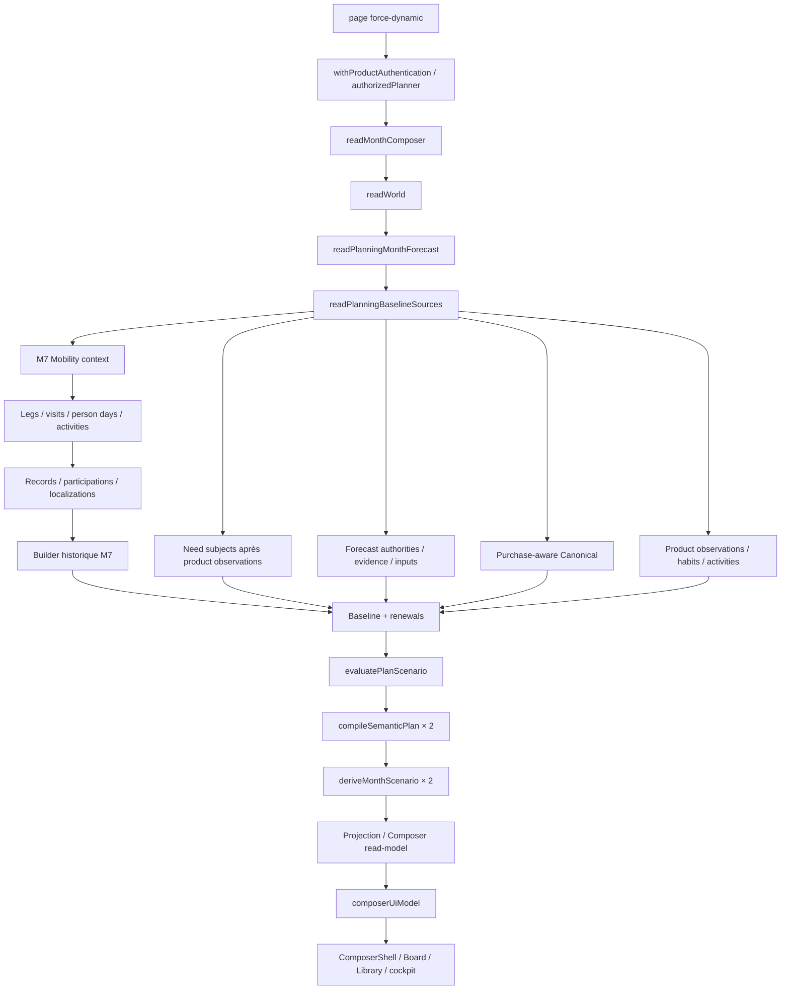

# Composer — P1, deep performance forensics

Diagnostic effectué les 6–7 octobre 2026 sur **R5 `3eba1887571aa649696a21beb0e642495d188fab`, `main` locale**. Production Next locale et autorités Supabase distantes authentifiées. Aucun patch d'optimisation produit, push, déploiement, write métier distant, Apply/RPC réel ou migration. Les variantes ont été exécutées dans une copie jetable puis restaurées.

Le [rapport P0](planner-composer-performance-audit-2026-10-06.md) définit les jalons, séries et limites. Les chemins source ci-dessous sont relatifs au dépôt `C:/Users/Manon/Documents/Codex/2026-09-28/ve/work/Budgetisation`. Les données financières, cookies et identifiants de requêtes restent hors Git.

## 1. Executive summary

**68,08 s médianes** jusqu'à la première interaction locale vérifiée. La première réponse arrive en **66,66 s médianes**. Le ratio des médianes indique environ **98 % avant cette réponse** ; il ne constitue pas une attribution CPU de 98 %.

La cause principale est le travail synchrone M7 sur l'historique Mobility : **832 557 tests de recouvrement**, avec **2 463 850 conversions d'instants**. Dans la lecture serveur détaillée de 67,51 s, la tranche pure après les dépendances M7 dure **41,11 s, 60,9 % du chemin critique**. La deuxième famille est l'hydratation historique Canonical : **291 GET métier distincts par ouverture Next**, en plusieurs couches parallèles et lots.

La réutilisation locale des instants et validations de fuseau ramène le replay complet sans réseau de **39,08 à 12,51 s médianes**, avec tous les digests comparés identiques. Une expérience alternée isole **329 ms** gagnables sur la double évaluation d'un état neutre. Ces corrections sont proposées pour P2 ; elles ne sont pas livrées ici.

Le frontend ajoute **1,41 s médianes après la première réponse** sur la série hard. Les sculptures ont un coût mesuré sur une fixture riche : **−685 ms après les données** avec un SVG neutre. Cette expérience CSR ne permet pas d'attribuer ce chiffre à la page SSR réelle ni de recommander l'abandon du design R5.

## 2. Baseline P0

| Mesure | Résultat | Portée |
|---|---:|---|
| P1_BASELINE_COLD_MS | 67 453 médiane, 52 810–120 675 | Cinq serveurs/contextes neufs ; startup exclu |
| P1_BASELINE_WARM_MS | 64 846 médiane réussites, 56 082–73 465 | Quatre succès ; cinquième censuré à 243 684 ms, Auth 504 |
| P1_BASELINE_TTI_MS | 68 076 médiane, 43 011–84 446 | Cinq hard refresh |
| Première réponse hard | 66 664 médiane | HTML/RSC, avant interaction |
| Navigation client RSC | 72 104 médiane, 36 309–82 115 | Cinq clics Centre → Piloter |
| P1_BASELINE_SERVER_MS | 67 506,7 | Une lecture headless réelle, séparée des runs navigateur |
| P1_BASELINE_DB_MS | Non isolable en un total additif | REST parallèle, CPU Node et SQL distincts |
| P1_BASELINE_QUERY_COUNT | 291 business GET Next ; 313 headless + 2 Auth | Memo Next absente du harness |
| P1_BASELINE_PAYLOAD_BYTES | 273 000 DTO ; 15 773 984 bodies DB headless | Octets décodés, répétitions incluses pour DB |
| P1_BASELINE_COMPILATIONS | 2 compile + 2 derive, 1 Baseline | État réel vide, zéro Context |

Pour cinq essais, le p95 par rang supérieur est le maximum. Le p95 warm incluant l'échec est au moins quatre minutes ; le maximum des réussites ne le remplace pas. Pas de benchmark Vercel R5 ni de cache froid Supabase.

## 3. Critical path

Intervalles **disjoints**, reconstruits dans un seul read-owner réel :

| Intervalle | ms | Part |
|---|---:|---:|
| Bootstrap/Auth → entrée readWorld | 1 230,8 | 1,8 % |
| readWorld → BaselineSources, forecast préalable | 1 761,1 | 2,6 % |
| Sources → fin de la dernière dépendance directe M7 | 19 019,0 | 28,2 % |
| Calcul M7 après cette dépendance | 41 113,1 | 60,9 % |
| Fin M7 → fin Sources | 2 140,7 | 3,2 % |
| Sources → fin readWorld | 189,7 | 0,3 % |
| World → fin readMonthComposer | 1 835,9 | 2,7 % |
| Conversion UI | 151,3 | 0,2 % |
| Résiduel final | 65,2 | 0,1 % |
| **Total** | **67 506,7** | **100 % arrondi** |

Les 19,02 s comprennent réseau, parsing, mapping et interruptions CPU ; elles ne sont pas du temps SQL pur. Purchase-aware 62,14 s, Sources 62,27 s, M7 authority 60,12 s sont des durées inclusives qui se recouvrent. Leurs sommes seraient trompeuses.

Profil CPU Node aligné avec une lecture replay : 41,21 s de fenêtre, **27,12 s M7 et descendants**, **2,83 s validation timezone**, **4,22 s GC**, 6,79 s autres. La classe « autres » inclut 1,70 s du clock gelé de l'audit. Ce profil sans réseau confirme une cause CPU ; GC n'est pas un gain indépendant à additionner à celui des allocations évitées.

## 4. Call graph



Le dépôt possède déjà une Map de requêtes Canonical et la memo de fetch Next. L'absence de réduction inter-owner s'explique en partie par des ensembles et options différents, pas par l'absence totale de cache.

## 5. DB surface

Reads concernés : opérations, allocations, items, payment components, cash uses, economic segments ; vues financières de coût, timing, reconciliation et places ; life events, participations, localizations, locations, mobility legs ; assertions/purchase/product/needs ; publications/snapshots forecast ; MonthInputs, PlannedExpenses, MonthPlans et révisions.

Postgres **17.6.1.155**, région **eu-central-1**, projet healthy au moment de l'inspection. Canonical utilise son client serveur privilégié ; les reads du Plan utilisent le client authenticated. Pas de credential serveur dans les bundles clients. Les bodies de lecture privée sont conservés dans le répertoire d'audit hors dépôt.

Comptages réels, pas `reltuples` : operations 1 660, items 72, allocations 34, payment components 3, cash uses 40, economic segments 0, location occurrences 2 375, life events 938, participations 1 142, purchase events 200, classifications 600. Les lignes retournées dans les GET peuvent répéter ces mêmes faits.

## 6. Query fingerprints

Le probe stocke la famille, méthode, rôle et hash du filtre/URL ; les valeurs restent privées. Une fingerprint stricte représente le même GET avec le même rôle. Une famille représente un template, avec éventuellement des ensembles IN, pages et fieldsets différents. Ne pas confondre les deux.

Table obligatoire : **Count, Mean et Total sont les GET et durées REST inclusives du run headless** ; Mean/Total en ms. **Total n'est pas une contribution additive au chemin critique.** Rows additionne les bodies retournés, répétitions incluses. Les plans sont estimés, pas exécutés avec ANALYZE. Les plans IN donnent la forme de lot représentative ; toutes les variantes d'ID ne sont pas reproduites ici.

| Query | Count | Mean | Total | Rows | Plan | Index state | Fix |
|---|---:|---:|---:|---:|---|---|---|
| Operations | 29 | 1 061 | 30 783 | 9 741 | IN : PK Index Scan, coût 104,92 ; pagination 145,63 | PK + source_tx unique, valides | Réduire champs/ensembles après preuve de couverture |
| Location occurrences | 22 | 1 148 | 25 263 | 3 553 | Bitmap PK, 68,98 | PK valide | Réutilisation des closures comparables |
| Economic cost canonical | 20 | 1 329 | 26 582 | 5 367 | IN 57 nœuds, 989,02 ; broad 61 nœuds, 1 556,83 | Indexes sous-jacents valides | Isoler coût broad et éviter relecture de même scope |
| Life event participations | 20 | 979 | 19 572 | 2 282 | Bitmap unique, 33,16 | Unique life_event/person_day | Conserver batching, éviter ensembles recouverts |
| Source person links | 16 | 1 613 | 25 809 | 111 | Seq Scan, 9,33 | Valides ; petit volume | Aucun index supplémentaire justifié |
| Economic timing canonical | 15 | 1 294 | 19 405 | 1 530 | 117 nœuds, 2 714,73 | Sous-jacents valides | Mesurer vue/JSON séparément du blocage Node |
| Operation place | 14 | 1 301 | 18 213 | 1 530 | 75 nœuds, 1 649,74 | Sous-jacents valides | Réutilisation au sein de la closure |
| Timing control | 14 | 1 427 | 19 974 | 1 530 | 75 nœuds, 1 653,18 | Sous-jacents valides | Même démarche |
| Cash uses | 13 | 1 253 | 16 292 | 40 | Seq Scan, 17,74 | Valides | Pas d'index speculative sur 40 lignes |
| Reconciliation | 13 | 1 152 | 14 981 | 1 490 | 71 nœuds, 1 479,66 | Sous-jacents valides | Éviter répétition de projection identique |
| Payment components | 13 | 1 222 | 15 888 | 3 | Seq Scan, 21,65 | Valides | Mutualiser les lots ; pas d'index prématuré |
| Allocations | 13 | 1 274 | 16 563 | 34 | Seq Scan, 14,08 | Valides | Même démarche |
| Operation items | 13 | 1 260 | 16 376 | 72 | Seq Scan, 7,56 | PK valide | Même démarche |
| Life events | 11 | 480 | 5 281 | 1 874 | Seq Scan broad, 101,56 | Valides | Garder fenêtre certifiée, optimiser parsing |
| Localizations | 10 | 404 | 4 040 | 1 372 | Index Only unique, 7,96 | Unique life_event/localization | Réutilisation request-local |
| Financial links | 10 | 364 | 3 639 | 292 | Family joins, plans des composants ci-dessus | Valides | Closure commune si authority comparable |

Un GET Next effectif lit moins de lots : Operations 26, Economic cost 18 ; les autres grandes familles gardent les comptes indiqués par P0. Les moyennes headless ne sont pas les moyennes de la série Next.

## 7. Duplicate/overlapping reads

**Next : 291 GET métier / 291 fingerprints strictes, donc zéro doublon HTTP strict par GET Composer.** Même résultat sur les cinq GET de navigation client. **Headless : 313 / 291, soit 22 répétitions strictes** absorbables par la memo dont il ne bénéficie pas. Ajouter aveuglément un nouveau deduper à Next ne peut donc pas promettre ces 22 économies.

Les ensembles recouvrent des faits : 38 377 lignes retournées et 15,77 MB, pour une base beaucoup plus petite. La capture unique contient 292 réponses avec Auth, 14,34 MB bruts et 1,67 MB gzip simulés. Cette différence mesure les réponses strictement répétées, pas toutes les lignes partagées entre IN différents.

`readActivePlan` apparaît deux fois, mais le GET physique identique est memoïsé dans Next. PredictionEvidence apparaît deux fois avec des options/champs/cutoffs différents : lectures inclusives d'environ 7,09 s et 1,25 s dans le run détaillé. Forecast authorities servent la publication, food et background. Une closure commune doit respecter la comparabilité locale des sources, leur publication et cutoff.

## 8. N+1

**Aucun pattern « une requête par ligne métier » identifié dans la trace étudiée.** Le fanout quantifié suit les lots : IN 100/120, concurrence trois par famille ; pagination 1 000 séquentielle. `projectEconomicComponentRows` hydrate dix familles en parallèle. Les familles à 13–29 GET viennent de ces lots et scopes, pas de 1 660 requêtes pour 1 660 opérations.

Needs subjects utilisent des lots de 100 clés après déduplication. Les liens d'activités utilisent les IDs des occurrences en lots. Pas de fetch SQL par carte, socket, sculpture ou candidat d'assistant au boot réel.

Le problème algorithmique équivalent est **en mémoire** : chaque lien de contexte cherche la présence dans les visites de l'autre personne. **832 557 overlaps** sont exécutés. Une structure d'intervalles pourrait éviter des candidats inutiles ; elle doit garder les frontières, les visites distinctes et leur identité exacte.

## 9. Sequential awaits

| Barrière | Preuve | Possibilité P2 | Condition |
|---|---|---|---|
| Forecast avant Sources | 1 761 ms observés | Démarrer les reads indépendants plus tôt | Admission forecast contre la même publication toujours obligatoire |
| Deux couches M7 | Structure legs/visits puis IDs de records/participations/localizations | Peu de parallélisme aveugle | La seconde couche dépend des IDs de la première |
| Activities puis financial links | `simpleRead()` ; links issus des occurrences | Garder la dépendance | Réutiliser les occurrences déjà lues si même fenêtre |
| Need subjects après toute la Promise.all | 2 141 ms de tail partagé, pas coût Needs isolé | Démarrer après product observations, avant la jointure globale | Réunir les Need keys réels et auto-eligible ; scope inchangé |
| Pages successives 1 000 | Nombre de pages/REST | Concurrence bornée à expérimenter | Ordre et pagination stables ; préserver charge DB |
| Discovery économique puis composants | IDs déduits de timing et scopes | Réutiliser `preloadEconomicFactsClosure` | Ne pas précharger un superset incomplet ou non autorisé |

Les dix principales branches Sources sont déjà parallèles. Aucune économie additionnelle arbitraire n'est attribuée à `Promise.all`. P2 peut retirer la barrière de jointure pour les Need subjects ; aucun gain chiffré causal n'a été obtenu pour cette modification.

## 10. Compiler/recomputation

Une ouverture réelle : **1 Baseline, 2 compile, 2 deriveMonthScenario, 4 forecastRemainingMonth**. `evaluatePlanScenario` construit l'état choisi et la référence neutre ; les impacts marginaux retirent successivement chaque control et Context et passent par le vrai compiler.

Pour C controls et K Contexts, le code réalise **2+C+K compile/derive** dans le chemin nominal, sous réserve des sorties en erreur/résolution. Le boot observé a C=K=0. Les scénarios riches d'assistant/impacts peuvent coûter davantage ; leurs temps distants ne sont pas extrapolés à partir de ce boot.

Le benchmark alterné sur le world privé capturé, entièrement en mémoire, mesure **672,683 → 344,097 ms médianes** pour une référence neutre réutilisée. Les comptes passent de 2 à 1 pour compiler et derive, tous les digests attendus identiques. Le gain causal est **328,586 ms** sur ce cas. Le gain apparent de 2,90 s sur deux séries complètes non randomisées ne doit pas être attribué à cette seule suppression.

## 11. Mobility

`src/analytics/global-v2/mobility-context.ts` convertit les bornes dans les helpers de recouvrement. Les mêmes timestamps sont reparsés dans les recherches pairwise. Une memo par build réduit **2 463 850 parses à 3 344**, réduction de **99,86 %**, sans changer le nombre d'accès ni de tests d'overlap.

M7 pur en replay : médiane baseline 29,07 s ; instant memo 7,93 s ; combined 8,50 s. La variation n'autorise pas à sommer les gains isolés. Après réutilisation des instants, les 832 557 comparaisons restent : c'est la prochaine cible structurelle.

Le work commute reste une autorité historique/structurelle. Il ne devient pas un levier arbitraire. Pas de Context dans le mois réel : aucun pricing prospectif TomTom/HERE ni fusion de journeys déclenché. La conversion fuel économique ne doit jamais devenir un débit bancaire fictif pour accélérer la projection.

## 12. Needs/Renewals

Product observations et Needs sont chargés pour l'autorité de sujets, AcquisitionEpisodes et profils de renouvellement. Les plans broad de `needs` et `product_observations` ont des coûts estimés **12,50 et 12,72**, avec Seq Scan justifiable sur ce volume. Ils ne démontrent pas une requête SQL de plusieurs dizaines de secondes.

Le builder final Baseline/Renewals occupe une tranche d'environ **190 ms**. Le tail de 2,14 s inclut plusieurs sources et les sujets Needs : l'appeler « temps Renewals » serait faux. Le replay inclut ce domaine et conserve baseline/unknown digests. Aucun apprentissage automatique de ShoppingSession ni calendrier artificiel n'est proposé.

## 13. Historical refs

La fenêtre commence au premier mois Canonical autorisé et se termine à la borne certifiée précédant le mois cible. Les références fermées dépendent de sourceRevision, location completeness et des completeMonthsBySource. Certaines lectures commencent large puis filtrent en mémoire, notamment le coût économique et Mobility.

C'est coûteux mais une limite « seulement le mois cible » changerait les références low/median/high, les floors réels et l'autorité personnelle. Toute réduction future doit comparer sourceRefs, baseline digest, historicalReferences, contraintes et diagnostics. Un cache interrequêtes requerrait household/persons, période, révision Canonical/publication, version modèle et cutoff ; aucun cache Baseline persistant n'est créé par cet audit.

## 14. Assistant

**Zéro resimulation de candidat au boot étudié.** Le read-model expose des capabilities ; le balance-assistant resimule via le compiler seulement lorsqu'il est demandé. Il est hors du chemin critique mesuré à l'ouverture.

La multiplication des compiles lors d'une demande d'assistant est un risque de latence future quantifiable par nombre de candidats, pas une cause des 68 s observées ici. P2 ne doit pas remplacer ces resimulations par une estimation financière locale. Acceptation invalide les anciens impacts, recompile puis régénère ; protected savings et Anchor/PRESERVE restent filtrés.

## 15. Compare

Le mode Compare UI utilise les projections serveur existantes ; pas de lecture DB additionnelle attribuée au clic local. La deuxième compile initiale sert la référence financière et ses slots possédés ; supprimer le panneau Compare ne supprimerait pas nécessairement cette doctrine.

La seule réutilisation prouvée est celle d'un état complètement neutre. Un guard fondé sur `controls.length === 0` serait insuffisant : Contexts, component selections, cancellations et slots Plan-owned doivent également être équivalents à la référence.

## 16. Payload

DTO réel **273 000 brut / 16 502 gzip simulé** : editors 150 239 (55 % brut), Library 42 143, Board 42 512, presentation 31 404, drop capabilities 3 054, control editors 2 776. Les editors gzip séparés font seulement 3 035 octets. Les gzip des groupes ne s'additionnent pas au total compressé.

15 cartes métier, 141 assets, zéro Context. Les structures d'editors sont répétitives : opportunité de référencer un schéma commun ou charger l'editor à l'ouverture, avec le même contrat de capabilities. Cela réduit parsing/allocations/transfert, sans pouvoir expliquer les 41 s M7.

Le JSON des réponses Supabase headless totalise **15,77 MB** ; Operations représente environ **5,60 MB**. Les `select('*')` et textes de montants sont une cible après vérification des consommateurs ; conserver la précision monétaire et les champs de provenance requis.

## 17. Bundle

15 scripts réels : **2 341 920 octets décodés / 631 465 compressés**. HTML : **955 209 / 49 655**. Les deux chunks Composer propres font **83 077 / 23 477** ; les plus gros chunks appartiennent aux dépendances partagées AppShell/ProductRuntime/query/exploration.

| Chunk | Brut | Compressé |
|---|---:|---:|
| `0vp09a_74fwny.js` | 739 979 | 194 051 |
| `0q2qzqc08oh9-.js` | 435 539 | 114 876 |
| `0ji9~eqdtbxlu.js` | 228 627 | 59 263 |
| `0ydn7jnvv-fld.js` | 183 746 | 54 292 |
| React DOM `10u3y4bw1ayzs.js` | 227 314 | 70 981 |
| Composer `0mhp893m944_4.js` | 80 461 | 22 452 |
| Composer `0el0bto.elwaf.js` | 2 616 | 1 025 |

Le manifest confirme les sept chunks partagés et deux spécifiques. `RootLayout` monte `ExplorationRuntimeHost`, avec imports query/history. Différer cette surface hors de ses routes est une proposition à vérifier end-to-end ; aucune dépendance supprimée pendant P1. Les prefetchs de sidebar observés durent environ 90–360 ms ; ils ne prouvent pas un read historique complet.

## 18. React

Le profil navigateur démarre avec le nouveau document : **4,02 s**, il ne couvre pas les 80 s d'attente serveur. React DOM et descendants ont environ **1 294 ms**, pas du self time React. Loader Turbopack 480 ms de self samples, `getBoundingClientRect` 642 ms, GC 184 ms. Le probe pollait le rectangle au début ; ce coût est donc une borne instrumentée, pas une attribution pure au carousel.

Fixture production, compteurs aux entrées des fonctions : à T4 Shell 1, Library 1, Board 1, cockpit 1, Carousel 2, ComposerCard 38, ContextCard 16, ContextSocket 56, AtomicPopover 119, ClayFrame 235. Plusieurs instances/passes de layout expliquent ces appels. Après recherche : Library 2, Shell/cockpit toujours 1, Carousel 3, ComposerCard 42.

Les premières estimations par flag Fiber `PerformedWork` ont été **rejetées** : le flag persiste sur certains bailouts. Les chiffres retenus viennent de compteurs réels dans une copie, pas de flags ni d'une reconstruction théorique. Pas de re-render global infini observé.

## 19. DOM/layout

DOM réel à apparition du Board : **8 579–8 583 éléments**. Après recherche vide : 2 325. Utiliser la seconde valeur comme DOM initial sous-estimerait le coût.

Fixture desktop **1728×900**, Board disponible **758 px**, mobile=false. Sculptures : **11 149 éléments**, 208 SVG. Variante neutre : **3 007 éléments**, toujours 208 SVG ; même réponse complète, mêmes nombres d'appels composants. TTI médian **2 798 → 1 712 ms**, post-JSON **1 403,6 → 719,0 ms**. Elle neutralise uniquement les descendants de ClayFrame pour mesurer leur coût.

Sur les hard réels, ResizeObserver est appelé une fois, callback 0–0,3 ms ; CLS 0,000039–0,000049. Premier run : 12 long tasks, 2 427 ms cumulés, max 782 ms ; suivants 3–8, 216–558 ms cumulés. Optimiser les SVG montés hors page visible et mutualiser les defs est à tester en conservant rendu/focus/navigation R5. Aucun code mobile requis.

## 20. Supabase query plans

**23 plans** de formes représentatives inspectés : neuf principaux, huit supplémentaires, six broad. EXPLAIN JSON **sans ANALYZE** ; coût estimé en unités du planner, jamais en millisecondes. Les templates privés couvrent les 47 familles extraites ; le rapport se concentre sur les familles fréquentes/coûteuses, petites requêtes et Plan.

Les vues financial ont `security_invoker=true`, unions de composants, window/count, remboursements et jointures, parfois des scans répétés d'Operations. Reconciliation 71 nœuds / 1 479,66 ; timing canonical 117 / 2 714,73 ; economic cost broad 61 / 1 556,83. Aucun spill exécuté déduit d'un EXPLAIN simple.

`pg_stat_statements`, observé sans reset, donne des **statistiques cumulatives non isolées à l'audit** : timing canonical environ 44,69 ms de moyenne sur 6 399 calls, timing control 37,37 ms sur 6 413, reconciliation 34,11 ms sur 6 240. Un template broad economic cost donne 468,74 ms sur 218 calls, max 7 060 ms. Les maxima cumulent l'historique et d'autres usages ; ils ne décrivent pas chaque ouverture. Les templates timing inspectés n'ont pas de temp blocks écrits dans ce snapshot.

PostgREST ajoute paramètres ANY, agrégation JSON et contexte de rôle ; les EXPLAIN avec littéraux sous postgres ne reproduisent pas entièrement son exécution. La requête classification LIMIT 1 au coût **0,05** prend **41 181 ms avant headers côté Node** dans le run réel : elle coïncide avec le calcul synchrone M7. Ce délai démontre pourquoi REST lent ne signifie pas automatiquement SQL lent.

## 21. Index audit

**213 indexes publics inspectés, 213 valid/ready.** Les PK/uniques sont utilisés pour Operations IN, locations, participations, localizations et month plan. Les snapshots combinent les indexes existants publication/resource via BitmapAnd, coût 66,19 ; MonthPlans household/targetMonth utilise son index, coût 2,37.

Operations a PK et source_tx unique, sans index de date séparé. Cela ne justifie pas de créer un index de date pour les requêtes IN par PK réellement fréquentes. Petites tables : Seq Scan souvent plus raisonnable que l'index. `reltuples=-1` signifie statistiques absentes, pas table vide ; un compteur `n_live_tup=0` après reset ne remplace pas COUNT.

Actions futures : mesure SQL isolée des formes broad, état ANALYZE/statistiques à discuter séparément, puis index couvrant un filtre effectivement coûteux seulement si son plan et sa sélectivité l'exigent. Aucun DDL, ANALYZE, index ou changement de vue exécuté ici.

## 22. RLS audit

16 policies pertinentes et dix définitions de vues inspectées. Les tables Plan ont une policy authenticated fondée sur **`(SELECT private.user_has_household_access(household_id))`**. Fonction STABLE, SECURITY DEFINER, search_path vide ; EXISTS dans memberships par user_id `(SELECT auth.uid())` et household_id. Index privé PK(user_id,household_id), index complémentaire(household_id,user_id).

Le paramètre household_id reste corrélé : ne pas prétendre que toute la fonction est automatiquement un unique InitPlan sur toutes les lignes. Le lookup réel du Plan est de très faible cardinalité et son REST est d'environ 90 ms dans la capture ; aucune preuve qu'il domine l'ouverture.

De nombreuses tables Canonical ont RLS active sans policy publique, car leur lecture utilise l'owner serveur privilégié. Ce mécanisme ne doit pas être désactivé. Le rôle postgres de l'inspection bypass RLS : les EXPLAIN ne mesurent pas un JWT utilisateur. Garder la séparation clients Canonical/Plan et les guards household.

## 23. Counterfactual experiments

Replay offline exact des GET capturés, aucun fallback réseau, clock gelé **2026-10-06T21:00:00Z** y compris Date legacy. Cinq exécutions par variante, mêmes autorités/semantic state. Les écarts de séries complètes ont une dispersion élevée sur cette machine ; les deux microbenchmarks alternent baseline et variante.

| Experiment | Baseline | Variant | Gain | Parity | Confidence |
|---|---:|---:|---:|---|---|
| Instant memo, read-owner replay | 39 075 ms | 16 468 ms | 22 607 ms, 58 % | Tous les digests identiques, parses 2,46 M → 3 344 | Forte sur cause/parité ; moyenne sur gain complet |
| Timezone memo, replay | 39 075 ms | 23 189 ms | 15 886 ms, 41 % | Tous digests identiques, validations 10 767 → 1 | Gain wall très variable ; ne pas l'assimiler au coût isolé |
| Neutral compile, replay | 39 075 ms | 36 180 ms | 2 896 ms apparent | Tous digests identiques | Faible sur ce delta wall ; microbenchmark causal ci-dessous |
| Instant + timezone, replay | 39 075 ms | 12 514 ms | 26 561 ms, 68 % | Tous digests identiques, mêmes comptes métier | Forte cause/parité ; moyenne gain wall |
| Timezone pur, cinq paires alternées | 2 150,235 ms | 1,342 ms | 2 148,893 ms | Fuseaux valides et erreurs invalides identiques | Forte dans cette boucle |
| Evaluate neutre pur, cinq paires | 672,683 ms | 344,097 ms | 328,586 ms | Manifest/projection/semantic attendus identiques, 2→1 compile/derive | Forte sur l'état réel vide |
| Sculptures, cinq fixtures desktop par version | 2 798 ms | 1 712 ms | 1 086 ms, 38,8 % | Réponse complète identique, compteurs composants identiques | Moyenne ; fixture CSR riche |
| Sculptures après JSON | 1 403,6 ms | 719,0 ms | 684,6 ms, 48,8 % | Même expérience | Ne pas transposer au SSR réel |

Replay baseline min/max 30,57/77,32 s ; combined 10,70/16,04 s. **Ne pas additionner les gains individuels.** Les 25 runs comparent semanticDigest, baselineDigest, projectionDigest, cardsDigest, capabilitiesDigest, manifestDigest, unknownDigest, taille UI et comptes. Le hash du DTO fixture complet est identique : `04faf4ea1493b84621b4d6cf74985560bd88172eef1e62e4236494b9ebe99eca`.

Tentatives exclues : replay à date différente après minuit, variant SVG initialement non appliquée à cause des séparateurs Windows, profils Fiber, reload CDP bloqués dans deux onglets d'audit. Le guard de variante normalise maintenant le chemin et vérifie que le patch est appliqué. Ces échecs ne constituent pas des preuves de bugs produit.

## 24. Top fixes

Top dix : (1) reparsing Temporal M7 ; (2) recherche pairwise historique ; (3) fanout Canonical/vues ; (4) validation timezone ; (5) forecast et authorities recouvertes ; (6) référence neutre recalculée ; (7) historique/selects larges ; (8) bundle runtime partagé ; (9) SVG/Library hors page visible ; (10) Auth externe et preview V2 concurrente. Classement de priorité, pas dix contributions additives.

Table obligatoire des inefficacités avec preuve runtime :

| File | Function | Problem | Runtime proof | Cost | Fix |
|---|---|---|---|---:|---|
| `src/analytics/global-v2/mobility-context.ts` | instant / overlaps / builder | Conversion répétée des mêmes bornes | 2 463 850 parses, 3 344 après memo, replay paritaire | M7 pur 41,11 s réel ; une partie évitable | Memo immuable bornée au build |
| Même fichier | Présence autre personne | Scan pairwise des visites par lien | 832 557 overlaps restent après memo | M7 combined médian 8,50 s | Index intervalles en mémoire, preuve frontières/identités |
| `src/core/time/values.ts` | parseHouseholdTimeZone | Validation Intl répétée | 10 767 appels même fuseau ; benchmark alterné | 2 150 ms → 1,3 ms pur | Réutiliser validation réussie avec borne de scope |
| `src/server/canonical/repository.ts` | projectEconomicComponentRows / loadEconomicFacts | Plusieurs familles × lots/scopes recouverts | 291 GET physiques ; plans 57–117 nœuds | Lecture/mapping critique 19,02 s, SQL partiel | Closure request-local comparable, pas nouvel owner |
| Même fichier | loaders Operations | Select large et mêmes faits répétés | Operations 5,60 MB décodés headless | Parsing/transport non isolés | Fields minimaux après audit des consommateurs |
| `src/server/phase2/planner/preview.ts` | evaluatePlanScenario | État neutre compilé/derivé deux fois | Paired pure 2 → 1 appels | Gain 329 ms | Réutiliser seulement sous équivalence complète |
| `src/server/phase2/planner/baseline-adapters.ts` | readPlanningBaselineSources | Sujets Needs attendent la jointure entière | Tail après M7 ; source keys après observations | Tail 2,14 s partagé, gain isolé inconnu | Chainer subjects à observations sans attendre autres branches |
| `src/app/layout.tsx` | RootLayout | Runtime exploration importé/monté globalement | Manifest shared chunks, profiler loader | Bundle total 2,34 MB brut | Différer par surface en gardant navigation |
| `src/app/mois-a-venir/composer/planner-icons/clay-frame.tsx` | ClayFrame et descendants | Sculptures détaillées répétées hors page visible | A/B 11 149 → 3 007 éléments | −685 ms post-data fixture | Définitions partagées/render visible, fidélité R5 obligatoire |
| `src/app/mois-a-venir` | Ouverture Centre puis Piloter | Preview V2 se poursuit pendant Composer | 27 GET supplémentaires, cinq POST locaux | 5,64–17,29 s inclusives et concurrentes | Éviter/annuler ce travail quand changement d'owner autorisé |

**Trois priorités faibles en risque :** memo instants par build ; validation timezone réutilisée ; calcul neutre réutilisé sous guard strict. Medium : interval index et closures comparables, lazy editors/Library/runtime. Structurel : authority historique réutilisable avec freshness/version/scope, puis optimisation des vues financières après SQL isolé. Ces propositions n'ont pas été appliquées au produit.

## 25. Risk matrix

| Changement proposé | Risque | Sauvegarde |
|---|---|---|
| Instant memo par build | Faible | Même Temporal parsing/erreurs ; reset à chaque build ; ne pas cacher des dates modifiées |
| Timezone memo | Faible | Même validateur, invalide toujours invalide ; cache borné sans mélange de scope |
| Neutral compile reuse | Moyen | Équivalence complète normalisée, slots possédés et legacy neutralization identiques |
| Index intervalles | Moyen/fort | Tests frontières, overlap, visites distinctes, révisions et parité M7 |
| Closure facts commune | Moyen/fort | Comparabilité, scopes client/rôle, cutoff/publication et provenance |
| Fenêtre réduite/cache historique | Fort | Historical refs stables, invalidation source/model ; aucun fait inconnu devenu zéro |
| Index/vue SQL | Moyen/fort | Temps isolés, plans, RLS/grants, autorisation distincte avant DDL |
| Lazy SVG/runtime/editors | Moyen UI | Fidélité R5, clavier/focus/drop/cockpit et DOM visible inchangés |

Toutes les variantes financières futures doivent conserver baseline facts, historical refs, unknown/unresolved, protected savings, work commute, identité d'occurrences, cash versus coût fuel, sourceRefs et manifest. Preview, Apply re-read/recompile, reload et stale guard doivent garder les mêmes autorités et projections. Une parité sur le seul état vide ne certifie pas les Contexts composites ou plans actifs.

## 26. P2 implementation plan

Commits indépendants proposés, **non réalisés** :

1. **`perf(mobility): reuse immutable instants within M7 build`** : cache build-local, tests invalid/boundary, suites Mobility/Planner, mêmes digests sur replay, cinq navigations complètes avant/après. Premier gain attendu le plus élevé.
2. **`perf(time): reuse validated household timezone`** : même logique de validation, portée bornée ; paired benchmark et régressions de dates/Needs. Mesurer après commit 1 pour éviter double compte.
3. **`perf(planner): reuse equivalent neutral evaluation`** : predicate explicite de neutralité complète, pas simple nombre d'opérations ; suites baseline, legacy assumptions, category targets, savings, preview/apply/reload sur fixtures sans remote writes.
4. **`perf(mobility): index historical presence intervals`** : suivant les mêmes identités/règles ; comparer chaque contexte/référence et diagnostics, benchmark synthetic scaling et replay réel privé.
5. **`perf(canonical): share comparable request closures`** : utiliser les owners/Map existants, dédupliquer les supersets compatibles ; chainer Need subjects à leur preuve ; comparer SQL fingerprints/counts et provenance, contrôler charges DB.
6. **`perf(composer): defer unused client surfaces`** : runtime partagé puis editors/Library visibles ; aucune compatibilité métier décidée dans React ; mêmes mutations et cockpit serveur, smoke desktop 1920/1728/1440 et hauteur disponible.
7. **`perf(icons): share sculpture definitions and bound mounting`** : préserver R5 visuellement ; mesurer DOM/layout après chaque itération, keyboard/focus/reparent/ONE_OF ; pas de livraison du SVG neutre de laboratoire.
8. **`perf(data): optimize measured broad financial reads`**, seulement après diagnostic SQL isolé complémentaire ; sélectionner champs requis, puis éventuelle proposition DDL séparée avec autorisation humaine. Pas de migration automatique dans P2.

Après chaque commit : typecheck/build, suites ciblées existantes, vérifier suites V2 quand owner partagé, même état/authorities→mêmes manifests/projection/unknowns, retour sans Plan compatible, stale preview zéro writes. Chaque nouveau profil utilise le même R5+patch, pas une autre base. Les timings doivent annoncer machine, mode, taille disponible et erreurs.

**Estimation prudente pour les trois premiers : 40–50 s au lieu de 68 s sur cette machine.** Elle utilise le gain combined replay 26,56 s et le gain pur compile 0,33 s, sans additionner les deux memos isolées. Ce délai n'a pas été observé dans une page complète optimisée : latence distante, fenêtres historiques et charge restent. Aucune promesse Vercel. Le gain structurel potentiel vient ensuite de l'index de présence puis de la réutilisation d'autorités avec freshness prouvée.

## 27. What is NOT responsible

Pas de candidat d'assistant évalué au boot ; pas de route TomTom/HERE pricée ; pas de RPC/Apply ; pas de calcul financier parallèle dans React ; pas d'index invalide trouvé ; pas de N+1 par carte/opération identifié ; pas de doublon HTTP strict dans le GET Next ; pas de boucle ResizeObserver observée. Compare utilise la projection existante. Le GC est lié aux allocations et les durées REST peuvent être gonflées par Node bloqué.

Cette liste décrit le chemin réel vide mesuré, pas tous les futurs états de Composer. L'Auth 504 est une cause d'échec warm observée, distincte du coût CPU normal.

## 28. Remaining uncertainty

Machine Windows d'environ 6 GB de RAM, pression mémoire et variance élevée ; séries complètes non randomisées. Les microbenchmarks timezone/compiler sont alternés. L'horloge gelée du replay ajoute environ 1,70 s de samples ; capture DB du premier owner environ 1,80 s d'overhead explicite déjà inclus. Les premiers polls DOM/profile ajoutent du layout. Pas de mesure Vercel R5.

T5 est un proxy de handlers, T6 vérifie la recherche locale. Temps des mutations preview distantes, assistant riche et Apply distant non mesurés : les writes métier sont interdits. Les suites R5 antérieures couvrent la composition/UndoRedo sur fixtures ; cet audit n'est pas une nouvelle certification d'Apply réel. Le code recrée le world aux actions, donc l'ouverture lente peut aussi affecter une preview suivante.

Plans sans ANALYZE, rôle postgres non équivalent au JWT, statistiques cumulatives partagées. Les templates fréquents/coûteux ont leur forme de plan ; le coût SQL exact par ouverture et les gains de nouveaux indexes restent inconnus. Aucun reset de stats, ANALYZE, migration ou modification RLS. Le build webpack de la copie instrumentée échoue sur `node:crypto` importé côté client ; les mesures réelles utilisent le build Turbopack R5 existant. Ce n'est pas un échec du build produit R5 démontré.

Preuves privées dans `C:/Users/Manon/Documents/Codex/2026-10-05/vu-x20/outputs/planner-performance` : browser-baseline, owner-baseline, baseline-cpu, db, experiments, compiler-paired.json, timezone-paired.json, fixture/desktop-baseline et fixture/desktop-clay-neutral. Les réponses/world privés ne sont pas committés. Tous les patches temporaires sont restaurés, code produit inchangé. Huit checks du probe vérifient le parentage, null exécuté une fois, GET et trois writes/RPC bloqués sur stubs locaux. Vérification finale : syntaxe des 13 scripts, trois guards refusant un runtime non isolé, 25 replays paritaires, cinq paires compiler, timezone paritaire et dix fixtures desktop réussies.

Outils committés, à lancer depuis la racine du dépôt :

| Helper | Usage |
|---|---|
| `audit-composer-performance-runtime.mjs` | Crée une copie hors checkout ; `--refresh-probes` nécessite son marqueur. Instrumente 136 fonctions dans 55 fichiers. |
| `lib/composer-performance-probe.cjs` | Preload Node, `COMPOSER_PERF_OUTPUT` requis ; writes/RPC métier bloqués. Capture privée seulement avec les flags explicites `COMPOSER_PERF_CAPTURE`, `COMPOSER_PERF_CAPTURE_WORLD`, `COMPOSER_PERF_PRIVATE_QUERIES`. |
| `audit-composer-performance-headless.mjs` | Arguments runtime, endpoint CDP du navigateur d'audit, output, nombre, mois ; auth en mémoire. |
| `audit-composer-performance-browser.mjs` | Arguments endpoint CDP, targetId, output, base URL, mode, nombre, runtime cold éventuel. |
| `audit-composer-performance-queries.mjs` | Transforme les filtres privés en SELECT/EXPLAIN ; n'exécute aucun SQL. |
| `audit-composer-performance-experiment.mjs` / `run-composer-performance-experiments.mjs` | Patches et orchestration offline dans la copie ; restauration en finally. |
| `audit-composer-performance-compiler.mjs` / `audit-composer-performance-timezone.mjs` | Benchmarks purs alternés avec parité. |
| `audit-composer-performance-fixture.mjs` | Host React production synthétique, baseline ou clay-neutral ; restaure les fichiers frontend à l'arrêt du child. |
| `analyze-composer-performance.mjs` / `analyze-composer-cpu-profile.mjs` | Statistiques, spans et profil CPU aligné ; les durées parallèles sont distinguées. |
| `check-composer-performance-probe.mjs` | Huit checks locaux ; aucun accès métier distant. |

Conserver tous les outputs privés hors Git ; passer les secrets uniquement par l'environnement local existant. Le replay doit utiliser la même date/cutoff et échoue si une réponse manque, sans appel distant de secours. Les scripts de contre-expérience sont des outils de diagnostic, pas des patches destinés à être appliqués au checkout produit.

**Le Composer est lent principalement parce qu'il reconstruit le contexte de mobilité historique en répétant des millions de conversions et recherches.** Les 291 lectures viennent surtout des lots d'hydratation Canonical et des autorités historiques. Les plans utilisent les indexes principaux ; certaines vues financières restent coûteuses, mais les délais REST de plusieurs secondes ne peuvent pas tous être attribués à SQL. La réutilisation d'instants par build est la correction à faible risque la plus rentable démontrée. Le frontend mérite ensuite une réduction du DOM et des dépendances sans dégrader R5.

```ini
PLANNER_COMPOSER_PERFORMANCE_FORENSICS = COMPLETE
```

Certification du diagnostic, de ses contre-expériences et du plan P2 ; aucune optimisation produit ni validation de déploiement incluse.
